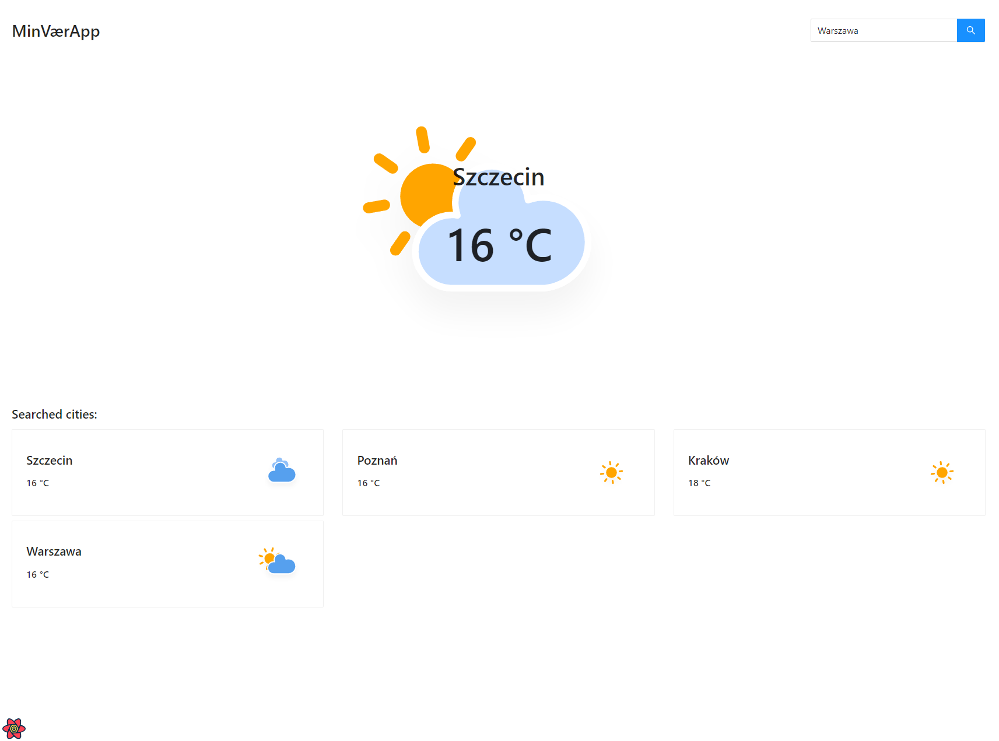
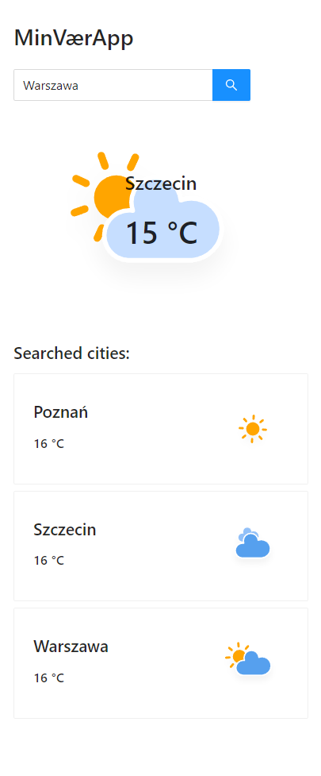

## Main description

Weather app for marketer.tech interview




## What could I do better

[] better type definition for APIs object
[] store in local storage searched cities or in DB

## Technological stack

- ant-design
- styled-components
- typescript
- cra
- axios
- react
- react-router
- react-query (server-state library)
- redux (client-state library)
- apollo with graphql
- eslint + prettier + husky
- cypress for E2E tests

## Directories structure

All code is under /src directory

- assets - directory for static assets like .svg icons
- components - reusable components in the whole application like button
- global - components that are used once in a whole application to provide some functionalities like RWD provider or layout
- helpers - functions that can be reused in few places in whole application
- pages - component responsible for given url adress like /home -> Home.tsx component
- services - directory for creating frontend services for managing a backend communication and leave abstraction for changes

## Task description

Set up a simple weather application where you can search for a city and have the weather presented visually. The sketch illustrates basic functionality, but you can be creative or add more if you'd like.

Some elements that should be included:

- A build system such as webpack with npm / yarn
- A frontend / UI framework using React
- Integration with a weather API of your choice to do lookups / retrieve data
- Responsiveness. Reformat the design based on experience for larger and smaller screens.
- The web application must be available online at a test URL
  -Unit and integration specs
-

UX

- Autocomplete search for cities with error handling
- List of recently searched cities and their weather/temperature
- Main weather and temperature should default to your current location (use the method you think to produce the most accurate result with a reasonable fallback mechanism)
- Whether you search for should display visually and the temperature

Criteria we consider

- Best practice for the structure of code
- Use of new features and libraries
- Best practice for accessibility
- Ability to spot and add important elements/states missing in design
- Creativity and ability to elevate the solution through interactions and visualization

## Available Scripts

In the project directory, you can run:

### `yarn start`

Runs the app in the development mode.<br />
Open [http://localhost:3000](http://localhost:3000) to view it in the browser.

The page will reload if you make edits.<br />
You will also see any lint errors in the console.

### `yarn test`

Launches the test runner in the interactive watch mode.<br />
See the section about [running tests](https://facebook.github.io/create-react-app/docs/running-tests) for more information.

### `yarn build`

Builds the app for production to the `build` folder.<br />
It correctly bundles React in production mode and optimizes the build for the best performance.

The build is minified and the filenames include the hashes.<br />
Your app is ready to be deployed!

See the section about [deployment](https://facebook.github.io/create-react-app/docs/deployment) for more information.

### `yarn eject`

**Note: this is a one-way operation. Once you `eject`, you can’t go back!**

If you aren’t satisfied with the build tool and configuration choices, you can `eject` at any time. This command will remove the single build dependency from your project.

Instead, it will copy all the configuration files and the transitive dependencies (Webpack, Babel, ESLint, etc) right into your project so you have full control over them. All of the commands except `eject` will still work, but they will point to the copied scripts so you can tweak them. At this point you’re on your own.

You don’t have to ever use `eject`. The curated feature set is suitable for small and middle deployments, and you shouldn’t feel obligated to use this feature. However we understand that this tool wouldn’t be useful if you couldn’t customize it when you are ready for it.

### `yarn start:build`

Calls `rimraf build && react-scripts build && serve -s build`.

### `yarn lint`

Checks eslint issues for project.

## Environment variables

To properly work with the project, You should create `.env` file with following structure:

```
REACT_APP_GRAPHQL_API_URL = // url to Your GraphQL API
REACT_APP_COPYRIGHT_EMAIL = // fallback email using in Copyright component
```

## Learn More

You can learn more in the [Create React App documentation](https://facebook.github.io/create-react-app/docs/getting-started).

To learn React, check out the [React documentation](https://reactjs.org/).

### Code Splitting

This section has moved here: https://facebook.github.io/create-react-app/docs/code-splitting

### Analyzing the Bundle Size

This section has moved here: https://facebook.github.io/create-react-app/docs/analyzing-the-bundle-size

### Making a Progressive Web App

This section has moved here: https://facebook.github.io/create-react-app/docs/making-a-progressive-web-app

### Advanced Configuration

This section has moved here: https://facebook.github.io/create-react-app/docs/advanced-configuration

### Deployment

This section has moved here: https://facebook.github.io/create-react-app/docs/deployment

### `yarn build` fails to minify

This section has moved here: https://facebook.github.io/create-react-app/docs/troubleshooting#npm-run-build-fails-to-minify
